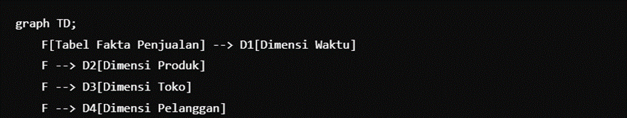
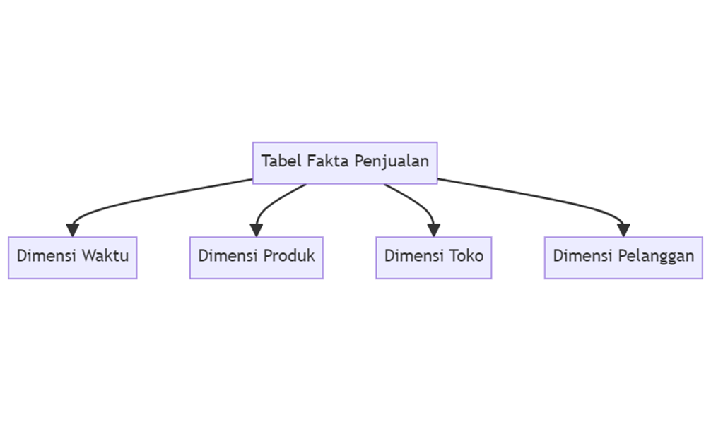
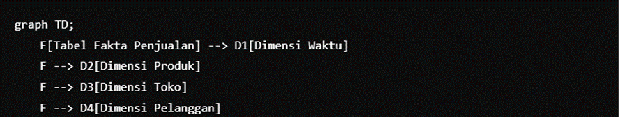

```Tugas #09 – Data Warehouse```

[15] [Juni] 2024

```- Nama Mahasiswa	:	Maulana Rangga Arrosyid```

```- NIM	:	20220801234```
```- Mata Kuliah	:	Data Warehouse```

```- Fakultas/Jurusan	:	Fakultas Ilmu Komputer / Prodi Teknik Informatika```

```- Kode Mata Kuliah	:	CSF415```

```- Nama Dosen	:	8389 – Ir. Tinuk Andriyanti Asianto, M.Kom.```

```Tugas```

Dengan mengacu ke kasus yang akan dibuat data warehouse/ data mart di mata kuliah ini, buatlah  ETL design nya.

```Jawaban Tugas```

Untuk mendesain proses ETL (Extract, Transform, Load) untuk data warehouse atau data mart berdasarkan tugas yang diberikan, ikuti langkah-langkah berikut:

```•	Langkah 1: Analisis Kebutuhan```
1.	Identifikasi Sumber Data: Tentukan dari mana data berasal (misalnya, basis data transaksi, file flat, API).
2.	Pahami Kebutuhan Bisnis: Klarifikasi informasi apa yang perlu disimpan di data warehouse dan laporan/analisis apa yang akan dihasilkan.

```•	Langkah 2: Extract (Ekstraksi)```
1.	Ekstraksi Data: Kembangkan strategi untuk mengekstrak data dari berbagai sumber. Ini bisa termasuk:

      •	Ekstraksi Terjadwal: Ekstraksi berkala (misalnya, harian, mingguan).

      •	Ekstraksi Real-time: Untuk data yang sensitif terhadap waktu.

      •	Pemrosesan Batch: Untuk kumpulan data yang besar.

```•	Langkah 3: Transform (Transformasi)```
1. Pembersihan Data: Tangani nilai yang hilang, hapus duplikasi, dan perbaiki kesalahan.

2. Integrasi Data: Gabungkan data dari berbagai sumber, pastikan konsistensi.

3. Transformasi Data: Ubah data menjadi format yang diinginkan. Ini termasuk:

•	Normalisasi: Sesuaikan data ke skala standar.

•	Agregasi: Ringkas data (misalnya, menghitung total atau rata-rata).

•	Derivasi: Buat bidang baru dari data yang ada (misalnya, menghitung usia dari tanggal lahir).

•	Langkah 4: Load (Pemrosesan Muatan)

```4. Pemrosesan Muatan Data: Muat data yang telah diubah ke dalam data warehouse/data mart.```

•	Muatan awal: Pertama kali data dimuat ke dalam warehouse.

•	Muatan inkremental: Pembaruan berkala dengan data baru.

```•	Alur Kerja ETL```
1. Penjadwalan dan Otomatisasi: Gunakan alat seperti Apache Nifi, Talend, atau Informatika untuk mengotomatisasi proses ETL.
2. Pemantauan dan Logging: Pastikan pemantauan yang kuat untuk mendeteksi dan menangani kesalahan selama proses ETL.

	```Contoh Input Desain ETL```
    
    ```Contoh Output Desain ETL```
    
    Berikut adalah penjelasan singkat mengenai star schema untuk kasus penjualan retail:

```Tabel Fakta Penjualan```

```Tabel Fakta Penjualan``` menyimpan data transaksi penjualan dan berisi metrik atau data numerik yang akan dianalisis. Tabel ini memiliki foreign key yang menghubungkan ke tabel dimensi untuk memberikan konteks lebih lanjut.

```Kolom-kolom dalam Tabel Fakta Penjualan:```

•	SalesID: ID unik untuk setiap transaksi penjualan.

•	DateID: Foreign key yang menghubungkan ke tabel dimensi Waktu.

•	ProductID: Foreign key yang menghubungkan ke tabel dimensi Produk.

•	StoreID: Foreign key yang menghubungkan ke tabel dimensi Toko.

•	CustomerID: Foreign key yang menghubungkan ke tabel dimensi Pelanggan.

•	Quantity: Jumlah produk yang terjual.

•	TotalAmount: Total nilai penjualan untuk transaksi tersebut.

```Tabel Dimensi```

Tabel dimensi berisi atribut deskriptif yang memberikan konteks untuk data dalam tabel fakta.

```1. Dimensi Waktu```

•	DateID: ID unik untuk setiap tanggal.

•	Date: Tanggal penjualan.

•	Month: Bulan penjualan.

•	Quarter: Kuartal penjualan.

•	Year: Tahun penjualan.

•	Day Of Week: Hari dalam minggu penjualan.

```2. Dimensi Produk```

•	ProductID: ID unik untuk setiap produk.

•	ProductName: Nama produk.

•	Category: Kategori produk.

•	SubCategory: Subkategori produk.

•	Brand: Merek produk.

```3. Dimensi Toko```

•	StoreID: ID unik untuk setiap toko.

•	StoreName: Nama toko.

•	Location: Lokasi toko.

•	Region: Wilayah tempat toko berada.

•	StoreType: Jenis toko.

```4. Dimensi Pelanggan```

•	CustomerID: ID unik untuk setiap pelanggan.

•	CustomerName: Nama pelanggan.

•	Gender: Jenis kelamin pelanggan.

•	Date Of Birth: Tanggal lahir pelanggan.

•	Email: Alamat email pelanggan.

•	Phone Number: Nomor telepon pelanggan.

```Diagram Input Star Schema```

```Diagram Output Star Schema```

```Penjelasan Diagram```

•	Tabel Fakta Penjualan berada di tengah sebagai pusat analisis, berisi data penjualan yang faktual dan numerik.

•	Dimensi Waktu: Memberikan konteks temporal (kapan) penjualan terjadi.

•	Dimensi Produk: Memberikan konteks tentang (apa) yang dijual.

•	Dimensi Toko: Memberikan konteks tentang (di mana) penjualan terjadi.

•	Dimensi Pelanggan: Memberikan konteks tentang (siapa) yang membeli.

```Kesimpulan```

Star schema ini mempermudah analisis data penjualan dari berbagai perspektif seperti waktu, produk, lokasi toko, dan pelanggan. Struktur ini sangat efisien untuk query analisis dan pelaporan dalam sistem data warehouse.

